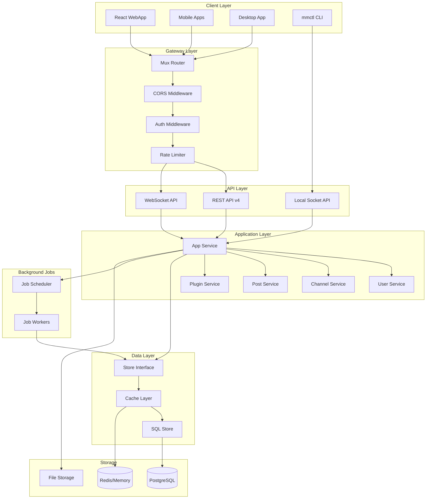
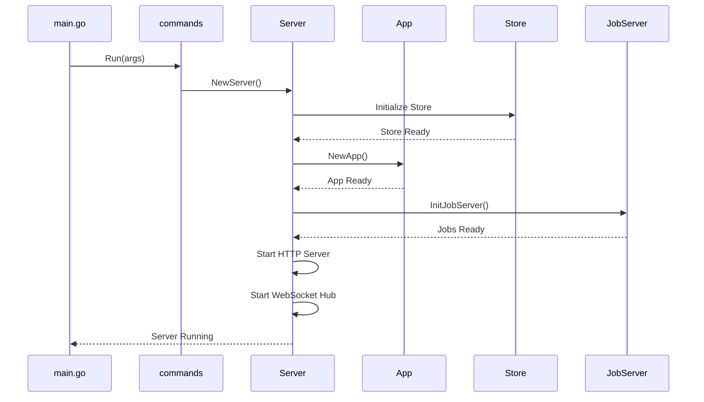
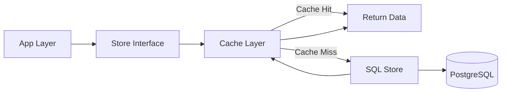
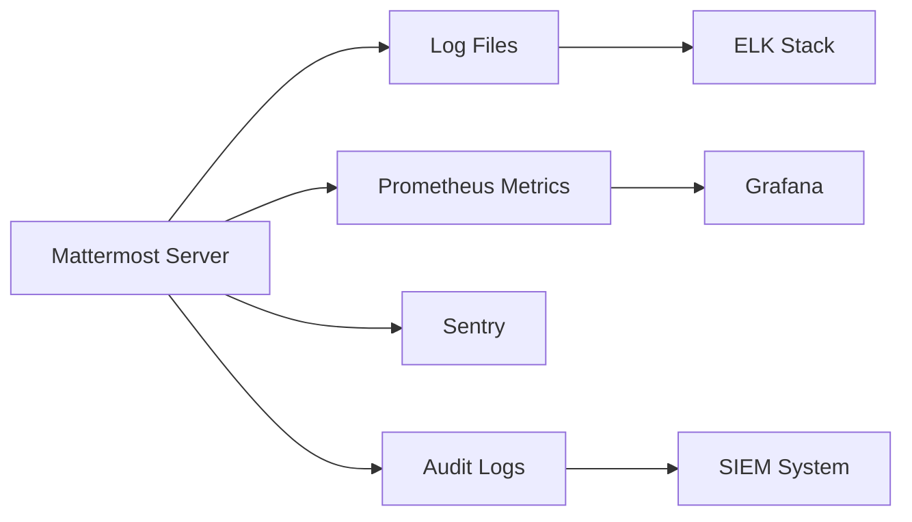
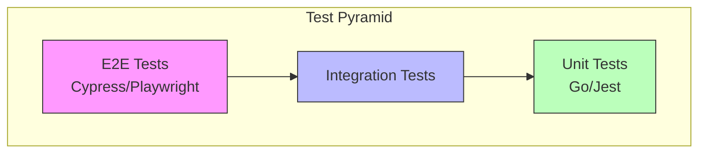
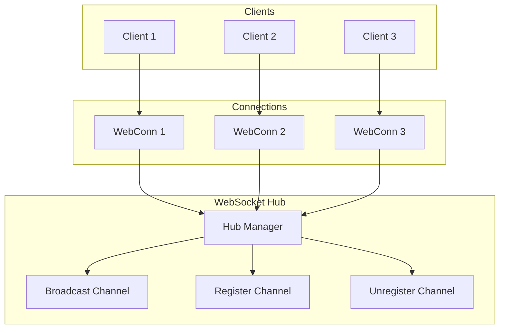
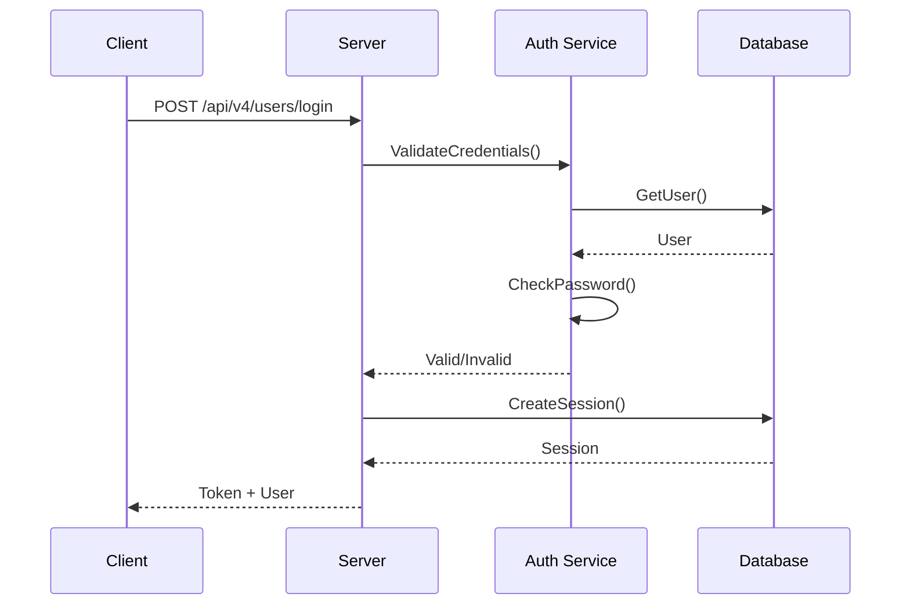
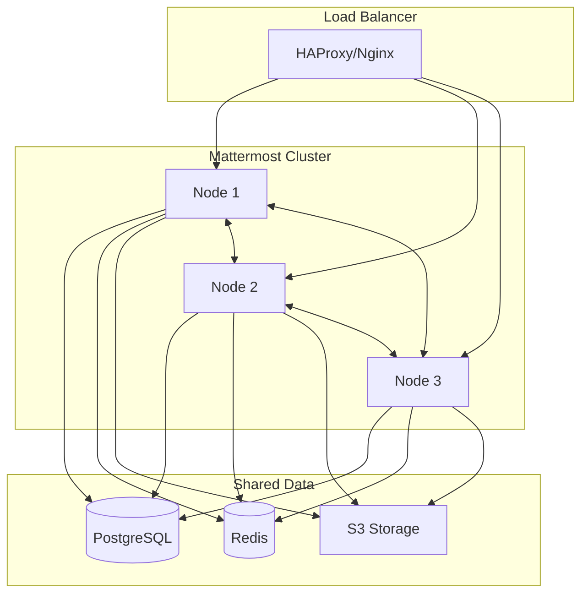

# OKR.BEST 프로젝트 아키텍처

이 문서는 OKR.BEST 프로젝트의 전체 아키텍처를 설명합니다.

---

## 목차

1. [프로젝트 개요](#1-프로젝트-개요)
2. [저장소/빌드/실행 정보](#2-저장소빌드실행-정보)
3. [디렉터리 구조 맵](#3-디렉터리-구조-맵)
4. [실행 흐름 (Runtime Flow)](#4-실행-흐름-runtime-flow)
5. [핵심 모듈/컴포넌트 설명](#5-핵심-모듈컴포넌트-설명)
6. [데이터 모델/저장소 접근](#6-데이터-모델저장소-접근)
7. [외부 연동/인터페이스](#7-외부-연동인터페이스)
8. [설정/구성 (Configurability)](#8-설정구성-configurability)
9. [에러 처리/로깅/관측성](#9-에러-처리로깅관측성)
10. [테스트 구조와 품질 게이트](#10-테스트-구조와-품질-게이트)
11. [변경 포인트 가이드](#11-변경-포인트-가이드)
12. [WebSocket 통신 구조](#12-websocket-통신-구조)
13. [플러그인 아키텍처](#13-플러그인-아키텍처)
14. [인증/권한 시스템](#14-인증권한-시스템)
15. [클러스터 구성](#15-클러스터-구성)

---

## 1. 프로젝트 개요

**OKR.BEST**는 Mattermost 플랫폼을 기반으로 한 오픈 코어 협업 플랫폼입니다.

### 주요 기능
- 실시간 채팅 및 메시징
- 워크플로우 자동화
- 음성 통화 및 화면 공유
- AI 통합
- 플러그인 시스템

### 기술 스택

| 영역 | 기술 |
|------|------|
| **Server** | Go 1.24 |
| **Webapp** | React 18, TypeScript, Redux |
| **Database** | PostgreSQL |
| **Cache** | Redis / In-Memory |
| **File Storage** | Local / S3 Compatible |
| **Build** | Make, Webpack |

---

## 2. 저장소/빌드/실행 정보

### 모노레포 구조

프로젝트는 모노레포 구조로 관리됩니다:

```
okrbest/
├── server/          # Go 백엔드 서버
├── webapp/          # React 프론트엔드
├── api/             # OpenAPI 스펙 정의
├── e2e-tests/       # E2E 테스트 (Cypress, Playwright)
└── tools/           # 개발 도구
```

### 빌드 시스템

#### 서버 빌드
```bash
cd server
make build                    # 서버 바이너리 빌드
make build-linux              # Linux용 빌드
make build-windows            # Windows용 빌드
make build-osx                # macOS용 빌드
```

#### 웹앱 빌드
```bash
cd webapp
make build                    # 프로덕션 빌드
make run                      # 개발 서버 실행
```

### 실행 방법

#### Docker Compose (권장)
```bash
cd server
docker-compose up -d
```

#### 직접 실행
```bash
# 서버 실행
./bin/mattermost server

# mmctl CLI 도구
./bin/mmctl --help
```

### 의존성 관리

| 영역 | 도구 | 파일 |
|------|------|------|
| Server | Go Modules | `server/go.mod`, `server/go.sum` |
| Webapp | npm | `webapp/package.json`, `webapp/package-lock.json` |

---

## 3. 디렉터리 구조 맵

```
okrbest/
├── server/                           # Go 백엔드
│   ├── bin/                          # 빌드된 바이너리
│   ├── build/                        # 빌드 스크립트
│   ├── channels/                     # 핵심 비즈니스 로직
│   │   ├── api4/                     # REST API v4 핸들러
│   │   ├── app/                      # 애플리케이션 레이어
│   │   │   ├── email/                # 이메일 서비스
│   │   │   ├── platform/             # 플랫폼 서비스
│   │   │   ├── slashcommands/        # 슬래시 명령어
│   │   │   └── users/                # 사용자 관리
│   │   ├── audit/                    # 감사 로그
│   │   ├── db/                       # 데이터베이스 유틸리티
│   │   ├── jobs/                     # 백그라운드 작업
│   │   │   ├── active_users/         # 활성 사용자 집계
│   │   │   ├── export_process/       # 내보내기 처리
│   │   │   ├── import_process/       # 가져오기 처리
│   │   │   └── migrations/           # 마이그레이션 작업
│   │   ├── store/                    # 데이터 액세스 레이어
│   │   │   ├── sqlstore/             # SQL 구현
│   │   │   ├── localcachelayer/      # 로컬 캐시 레이어
│   │   │   ├── retrylayer/           # 재시도 레이어
│   │   │   └── searchlayer/          # 검색 레이어
│   │   ├── web/                      # 웹 서버
│   │   └── wsapi/                    # WebSocket API
│   ├── cmd/                          # CLI 진입점
│   │   ├── mattermost/               # 메인 서버 명령
│   │   └── mmctl/                    # 관리 CLI 도구
│   ├── config/                       # 설정 관리
│   ├── einterfaces/                  # 엔터프라이즈 인터페이스
│   ├── enterprise/                   # 엔터프라이즈 기능
│   ├── i18n/                         # 국제화 리소스
│   ├── platform/                     # 공유 서비스
│   │   └── services/                 # 플랫폼 서비스
│   │       ├── cache/                # 캐시 서비스
│   │       ├── remotecluster/        # 원격 클러스터
│   │       └── sharedchannel/        # 공유 채널
│   ├── public/                       # 공개 API
│   │   └── model/                    # 데이터 모델
│   └── templates/                    # 이메일 템플릿
│
├── webapp/                           # React 프론트엔드
│   ├── channels/                     # 메인 웹앱
│   │   ├── build/                    # 빌드 설정
│   │   └── src/                      # 소스 코드
│   │       ├── actions/              # Redux 액션
│   │       ├── client/               # API 클라이언트
│   │       ├── components/           # React 컴포넌트
│   │       ├── hooks/                # React 훅
│   │       ├── i18n/                 # 국제화
│   │       ├── plugins/              # 플러그인 시스템
│   │       ├── reducers/             # Redux 리듀서
│   │       ├── selectors/            # Redux 셀렉터
│   │       ├── store/                # Redux 스토어
│   │       ├── types/                # TypeScript 타입
│   │       └── utils/                # 유틸리티
│   └── platform/                     # 플랫폼 공유 코드
│
├── api/                              # API 스펙
│   └── v4/                           # OpenAPI v4 스펙
│
└── e2e-tests/                        # E2E 테스트
    ├── cypress/                      # Cypress 테스트
    └── playwright/                   # Playwright 테스트
```

---

## 4. 실행 흐름 (Runtime Flow)

### 전체 아키텍처 다이어그램



### 요청 처리 흐름

1. **클라이언트 요청**: 웹앱/모바일/데스크톱에서 HTTP/WebSocket 요청
2. **라우터**: Gorilla Mux 라우터에서 요청 라우팅
3. **미들웨어 체인**: CORS → 인증 → Rate Limiting
4. **API 핸들러**: REST API v4 또는 WebSocket API에서 처리
5. **앱 레이어**: 비즈니스 로직 실행
6. **스토어 레이어**: 데이터 액세스 (캐시 → SQL)
7. **응답**: 클라이언트로 결과 반환

### 서버 시작 흐름



---

## 5. 핵심 모듈/컴포넌트 설명

### 서버 측 핵심 모듈

#### Server (`server/channels/app/server.go`)
HTTP 서버의 핵심 구조체로, 모든 서비스를 초기화하고 관리합니다.

```go
type Server struct {
    RootRouter  *mux.Router      // 루트 HTTP 라우터
    Router      *mux.Router      // 메인 라우터
    Store       store.Store      // 데이터 스토어
    Jobs        *jobs.JobServer  // 백그라운드 작업 서버
    // ...
}
```

#### App Layer (`server/channels/app/`)
비즈니스 로직을 담당하는 애플리케이션 레이어입니다.

| 파일 | 설명 |
|------|------|
| `app.go` | App 구조체 및 초기화 |
| `channel.go` | 채널 관리 로직 |
| `post.go` | 포스트/메시지 관리 |
| `user.go` | 사용자 관리 |
| `authentication.go` | 인증 로직 |
| `authorization.go` | 권한 검사 |
| `plugin.go` | 플러그인 관리 |
| `webhook.go` | 웹훅 처리 |
| `notification.go` | 알림 처리 |

#### API4 (`server/channels/api4/`)
REST API v4 엔드포인트 핸들러입니다.

| 파일 | 엔드포인트 |
|------|------------|
| `user.go` | `/api/v4/users/*` |
| `channel.go` | `/api/v4/channels/*` |
| `post.go` | `/api/v4/posts/*` |
| `team.go` | `/api/v4/teams/*` |
| `file.go` | `/api/v4/files/*` |
| `plugin.go` | `/api/v4/plugins/*` |
| `websocket.go` | `/api/v4/websocket` |

#### Store (`server/channels/store/`)
데이터 액세스 레이어로, 인터페이스 기반 설계입니다.

```
store/
├── store.go              # Store 인터페이스 정의
├── sqlstore/             # PostgreSQL 구현
├── localcachelayer/      # 로컬 캐시 레이어
├── retrylayer/           # DB 연결 재시도 레이어
├── searchlayer/          # 검색 기능 레이어
└── timerlayer/           # 성능 측정 레이어
```

### 웹앱 측 핵심 모듈

#### Entry Point (`webapp/channels/src/`)

| 파일 | 설명 |
|------|------|
| `entry.tsx` | 앱 진입점 |
| `root.tsx` | 루트 컴포넌트 |
| `module_registry.ts` | 모듈 레지스트리 |

#### Redux Store (`webapp/channels/src/store/`)
전역 상태 관리를 위한 Redux 설정입니다.

#### Components (`webapp/channels/src/components/`)
주요 React 컴포넌트:
- `post_view/` - 포스트 렌더링
- `channel_view/` - 채널 뷰
- `sidebar/` - 사이드바
- `admin_console/` - 관리자 콘솔

#### Actions (`webapp/channels/src/actions/`)
Redux 액션 및 API 호출:
- `channel_actions.ts` - 채널 관련 액션
- `post_actions.ts` - 포스트 관련 액션
- `user_actions.ts` - 사용자 관련 액션
- `websocket_actions.jsx` - WebSocket 이벤트 처리

---

## 6. 데이터 모델/저장소 접근

### 모델 정의

모든 데이터 모델은 `server/public/model/`에 정의되어 있습니다.

#### 핵심 모델

| 모델 | 파일 | 설명 |
|------|------|------|
| User | `user.go` | 사용자 정보 |
| Team | `team.go` | 팀/워크스페이스 |
| Channel | `channel.go` | 채널 |
| Post | `post.go` | 메시지/포스트 |
| Session | `session.go` | 세션 정보 |
| FileInfo | `file_info.go` | 파일 메타데이터 |
| Emoji | `emoji.go` | 커스텀 이모지 |
| Reaction | `reaction.go` | 리액션 |
| Config | `config.go` | 시스템 설정 |

#### 모델 예시: Post

```go
type Post struct {
    Id            string          `json:"id"`
    CreateAt      int64           `json:"create_at"`
    UpdateAt      int64           `json:"update_at"`
    DeleteAt      int64           `json:"delete_at"`
    UserId        string          `json:"user_id"`
    ChannelId     string          `json:"channel_id"`
    RootId        string          `json:"root_id"`
    Message       string          `json:"message"`
    Type          string          `json:"type"`
    Props         StringInterface `json:"props"`
    Hashtags      string          `json:"hashtags"`
    FileIds       StringArray     `json:"file_ids,omitempty"`
    Metadata      *PostMetadata   `json:"metadata,omitempty"`
}
```

### Store 인터페이스

`server/channels/store/store.go`에서 Store 인터페이스를 정의합니다:

```go
type Store interface {
    User() UserStore
    Team() TeamStore
    Channel() ChannelStore
    Post() PostStore
    Session() SessionStore
    FileInfo() FileInfoStore
    Reaction() ReactionStore
    // ... 기타 스토어
    Close()
}
```

### SQL Store 구현

`server/channels/store/sqlstore/`에서 PostgreSQL 구현:

| 파일 | 테이블 |
|------|--------|
| `user_store.go` | Users |
| `team_store.go` | Teams |
| `channel_store.go` | Channels |
| `post_store.go` | Posts |
| `session_store.go` | Sessions |
| `file_info_store.go` | FileInfo |

### 캐시 레이어

`server/channels/store/localcachelayer/`에서 자주 접근하는 데이터 캐싱:

- 사용자 정보
- 채널 정보
- 세션 데이터
- 설정 값

### 데이터 접근 흐름



---

## 7. 외부 연동/인터페이스

### REST API v4

#### API 문서
- OpenAPI 스펙: `api/v4/`
- 기본 URL: `/api/v4/`

#### 주요 엔드포인트

| 카테고리 | 엔드포인트 | 설명 |
|----------|------------|------|
| Users | `GET /users` | 사용자 목록 |
| | `POST /users` | 사용자 생성 |
| | `GET /users/{user_id}` | 사용자 조회 |
| Teams | `GET /teams` | 팀 목록 |
| | `POST /teams` | 팀 생성 |
| Channels | `GET /channels` | 채널 목록 |
| | `POST /channels` | 채널 생성 |
| Posts | `GET /posts` | 포스트 조회 |
| | `POST /posts` | 포스트 생성 |
| Files | `POST /files` | 파일 업로드 |
| | `GET /files/{file_id}` | 파일 다운로드 |

### WebSocket API

실시간 이벤트 처리를 위한 WebSocket 연결:

```
ws://{server}/api/v4/websocket
```

#### 주요 이벤트 타입

| 이벤트 | 설명 |
|--------|------|
| `posted` | 새 포스트 |
| `post_edited` | 포스트 수정 |
| `post_deleted` | 포스트 삭제 |
| `typing` | 타이핑 표시 |
| `channel_viewed` | 채널 조회 |
| `user_added` | 사용자 추가 |
| `user_removed` | 사용자 제거 |
| `reaction_added` | 리액션 추가 |
| `reaction_removed` | 리액션 제거 |

### 플러그인 시스템

플러그인 API: `server/public/plugin/`

#### 플러그인 훅

| 훅 | 설명 |
|-----|------|
| `OnActivate` | 플러그인 활성화 |
| `OnDeactivate` | 플러그인 비활성화 |
| `MessageWillBePosted` | 포스트 전처리 |
| `MessageHasBeenPosted` | 포스트 후처리 |
| `UserHasJoinedChannel` | 채널 참가 |
| `UserHasLeftChannel` | 채널 퇴장 |

### 웹훅

#### Incoming Webhooks
외부 서비스에서 메시지를 보낼 때 사용:

```bash
curl -X POST -H 'Content-Type: application/json' \
  -d '{"text": "Hello from webhook"}' \
  https://{server}/hooks/{webhook_id}
```

#### Outgoing Webhooks
특정 트리거에 외부 URL 호출:
- 트리거 워드 매칭
- 채널별 설정 가능

### 슬래시 명령어

내장 명령어: `server/channels/app/slashcommands/`

| 명령어 | 설명 |
|--------|------|
| `/join` | 채널 참가 |
| `/leave` | 채널 퇴장 |
| `/invite` | 사용자 초대 |
| `/kick` | 사용자 추방 |
| `/mute` | 채널 음소거 |
| `/search` | 메시지 검색 |
| `/settings` | 설정 열기 |

### OAuth 제공자

지원하는 OAuth 제공자:
- GitLab
- Google
- Office 365
- OpenID Connect

설정 위치: `server/channels/app/oauthproviders/`

---

## 8. 설정/구성 (Configurability)

### 설정 소스

설정은 다음 순서로 로드됩니다:

1. **기본값**: 코드에 정의된 기본 설정
2. **설정 파일**: `config.json`
3. **환경 변수**: `MM_*` 접두사
4. **데이터베이스**: DB에 저장된 설정 (클러스터 환경)

### 설정 파일 구조

`config.json` 주요 섹션:

```json
{
  "ServiceSettings": {
    "SiteURL": "https://example.com",
    "ListenAddress": ":8065",
    "EnableLinkPreviews": true
  },
  "TeamSettings": {
    "MaxUsersPerTeam": 50,
    "EnableOpenServer": false
  },
  "SqlSettings": {
    "DriverName": "postgres",
    "DataSource": "postgres://...",
    "MaxOpenConns": 300
  },
  "FileSettings": {
    "DriverName": "local",
    "Directory": "./data/"
  },
  "EmailSettings": {
    "EnableSignUpWithEmail": true,
    "SMTPServer": "smtp.example.com"
  },
  "PluginSettings": {
    "Enable": true,
    "Directory": "./plugins"
  }
}
```

### 설정 관리 코드

| 파일 | 설명 |
|------|------|
| `server/config/store.go` | 설정 저장소 인터페이스 |
| `server/config/file.go` | 파일 기반 설정 |
| `server/config/database.go` | DB 기반 설정 |
| `server/config/environment.go` | 환경 변수 처리 |
| `server/public/model/config.go` | 설정 구조체 정의 |

### 주요 설정 구조체

`server/public/model/config.go`:

```go
type Config struct {
    ServiceSettings       ServiceSettings
    TeamSettings          TeamSettings
    ClientRequirements    ClientRequirements
    SqlSettings           SqlSettings
    LogSettings           LogSettings
    FileSettings          FileSettings
    EmailSettings         EmailSettings
    RateLimitSettings     RateLimitSettings
    PluginSettings        PluginSettings
    // ... 기타 설정
}
```

### 기능 플래그

`server/public/model/feature_flags.go`:

실험적 기능을 제어하는 기능 플래그 시스템:

```go
type FeatureFlags struct {
    TestFeature     bool
    PermalinkPreviews bool
    // ... 기타 플래그
}
```

### 환경 변수 매핑

환경 변수는 `MM_` 접두사를 사용하며, 설정 경로를 언더스코어로 연결:

| 환경 변수 | 설정 경로 |
|-----------|-----------|
| `MM_SERVICESETTINGS_SITEURL` | ServiceSettings.SiteURL |
| `MM_SQLSETTINGS_DATASOURCE` | SqlSettings.DataSource |
| `MM_FILESETTINGS_DRIVERNAME` | FileSettings.DriverName |

---

## 9. 에러 처리/로깅/관측성

### 에러 처리

#### AppError 모델

`server/public/model/`에서 정의된 표준 에러 모델:

```go
type AppError struct {
    Id            string `json:"id"`
    Message       string `json:"message"`
    DetailedError string `json:"detailed_error"`
    StatusCode    int    `json:"status_code"`
    Where         string `json:"-"`
}
```

#### 에러 생성 패턴

```go
func (a *App) GetUser(userId string) (*model.User, *model.AppError) {
    user, err := a.Srv().Store().User().Get(userId)
    if err != nil {
        return nil, model.NewAppError("GetUser", "app.user.get.error", nil, err.Error(), http.StatusNotFound)
    }
    return user, nil
}
```

### 로깅 시스템

#### mlog 패키지

구조화된 로깅을 위한 `mlog` 패키지 사용:

```go
import "github.com/mattermost/mattermost/server/public/shared/mlog"

// 로그 레벨별 사용
mlog.Debug("Debug message", mlog.String("key", "value"))
mlog.Info("Info message", mlog.Int("count", 42))
mlog.Warn("Warning message", mlog.Err(err))
mlog.Error("Error message", mlog.String("user_id", userId))
```

#### 로그 설정

`config.json`의 `LogSettings`:

```json
{
  "LogSettings": {
    "EnableConsole": true,
    "ConsoleLevel": "INFO",
    "ConsoleJson": false,
    "EnableFile": true,
    "FileLevel": "INFO",
    "FileJson": true,
    "FileLocation": "/var/log/mattermost/mattermost.log"
  }
}
```

### 감사 로그

`server/channels/audit/`:

보안 관련 이벤트를 기록하는 감사 로그:

- 로그인/로그아웃
- 권한 변경
- 설정 변경
- 사용자 생성/삭제

### 메트릭 (Prometheus)

`server/einterfaces/metrics.go`:

#### 주요 메트릭

| 메트릭 | 설명 |
|--------|------|
| `mattermost_http_requests_total` | HTTP 요청 수 |
| `mattermost_db_connections` | DB 연결 수 |
| `mattermost_websocket_connections` | WebSocket 연결 수 |
| `mattermost_post_total` | 총 포스트 수 |
| `mattermost_cluster_health` | 클러스터 상태 |

#### 메트릭 활성화

```json
{
  "MetricsSettings": {
    "Enable": true,
    "ListenAddress": ":8067"
  }
}
```

### Sentry 통합

에러 추적을 위한 Sentry 통합:

```go
var SentryDSN = "https://xxx@sentry.io/xxx"
```

### 관측성 아키텍처



---

## 10. 테스트 구조와 품질 게이트

### 서버 테스트

#### 단위 테스트
- 위치: 각 패키지 내 `*_test.go` 파일
- 실행: `make test-server`

```bash
# 전체 서버 테스트
make test-server

# 특정 패키지 테스트
go test ./channels/app/...

# 커버리지 포함
make test-server ENABLE_COVERAGE=true
```

#### 테스트 유틸리티
- `server/channels/testlib/` - 테스트 헬퍼
- `server/channels/app/apitestlib.go` - API 테스트 유틸리티

### 웹앱 테스트

#### Jest 테스트
- 설정: `webapp/channels/jest.config.js`
- 실행: `make test` (webapp 디렉토리)

```bash
# 전체 테스트
npm test

# 특정 파일 테스트
npm test -- --testPathPattern="post_actions"

# 커버리지
npm test -- --coverage
```

### E2E 테스트

#### Cypress
- 위치: `e2e-tests/cypress/`
- 설정: `cypress.config.ts`

```bash
cd e2e-tests
npm run cypress:open  # 인터랙티브 모드
npm run cypress:run   # 헤드리스 모드
```

#### Playwright
- 위치: `e2e-tests/playwright/`

```bash
cd e2e-tests
npx playwright test
```

### 품질 게이트

#### 코드 스타일
```bash
# Go 린팅
make check-server-style

# 웹앱 린팅
make check-client-style
```

#### 테스트 커버리지 목표
- 서버: 주요 비즈니스 로직 80% 이상
- 웹앱: 핵심 컴포넌트 70% 이상

### 테스트 피라미드



---

## 11. 변경 포인트 가이드

### 새로운 API 엔드포인트 추가

1. **핸들러 작성** (`server/channels/api4/`)
```go
// server/channels/api4/example.go
func (api *API) InitExample() {
    api.BaseRoutes.Example.Handle("", api.APISessionRequired(getExample)).Methods("GET")
    api.BaseRoutes.Example.Handle("", api.APISessionRequired(createExample)).Methods("POST")
}

func getExample(c *Context, w http.ResponseWriter, r *http.Request) {
    // 구현
}
```

2. **라우트 등록** (`server/channels/api4/api.go`)
```go
api.InitExample()
```

3. **비즈니스 로직** (`server/channels/app/`)
```go
func (a *App) GetExample(id string) (*model.Example, *model.AppError) {
    // 구현
}
```

### 새로운 데이터 모델 추가

1. **모델 정의** (`server/public/model/`)
```go
// server/public/model/example.go
type Example struct {
    Id        string `json:"id"`
    Name      string `json:"name"`
    CreatedAt int64  `json:"created_at"`
}
```

2. **Store 인터페이스** (`server/channels/store/store.go`)
```go
type Store interface {
    // ...
    Example() ExampleStore
}

type ExampleStore interface {
    Save(example *model.Example) (*model.Example, error)
    Get(id string) (*model.Example, error)
    Delete(id string) error
}
```

3. **SQL 구현** (`server/channels/store/sqlstore/`)
```go
// server/channels/store/sqlstore/example_store.go
type SqlExampleStore struct {
    *SqlStore
}

func (s *SqlExampleStore) Save(example *model.Example) (*model.Example, error) {
    // 구현
}
```

4. **DB 마이그레이션** (`server/channels/db/migrations/`)

### 새로운 React 컴포넌트 추가

1. **컴포넌트 작성** (`webapp/channels/src/components/`)
```tsx
// webapp/channels/src/components/example/example.tsx
import React from 'react';

type Props = {
    title: string;
};

const Example: React.FC<Props> = ({title}) => {
    return <div className="example">{title}</div>;
};

export default Example;
```

2. **스타일 추가** (`webapp/channels/src/sass/`)
```scss
// webapp/channels/src/sass/components/_example.scss
.example {
    padding: 16px;
}
```

3. **Redux 연결** (필요시)
```tsx
import {connect} from 'react-redux';
import {getExample} from 'selectors/example';

const mapStateToProps = (state) => ({
    example: getExample(state),
});

export default connect(mapStateToProps)(Example);
```

### 새로운 Redux 액션 추가

1. **액션 타입** (`webapp/channels/src/action_types/`)
2. **액션 생성자** (`webapp/channels/src/actions/`)
3. **리듀서** (`webapp/channels/src/reducers/`)
4. **셀렉터** (`webapp/channels/src/selectors/`)

### 플러그인 개발

1. **플러그인 매니페스트** (`plugin.json`)
2. **서버 플러그인** (Go)
3. **웹앱 플러그인** (JavaScript/TypeScript)

참조: [플러그인 개발 문서](https://developers.mattermost.com/integrate/plugins/)

---

## 12. WebSocket 통신 구조

### WebSocket Hub 아키텍처



### 주요 파일

| 파일 | 설명 |
|------|------|
| `server/channels/app/web_hub.go` | Hub 관리 |
| `server/channels/app/web_conn.go` | WebSocket 연결 |
| `server/channels/wsapi/` | WebSocket API |
| `webapp/channels/src/actions/websocket_actions.jsx` | 클라이언트 WebSocket 처리 |

### 이벤트 흐름

1. **서버에서 이벤트 발생** (예: 새 포스트)
2. **Hub에 브로드캐스트 요청**
3. **관련 사용자의 WebSocket 연결로 전송**
4. **클라이언트에서 이벤트 수신 및 처리**

### WebSocket 메시지 구조

```json
{
  "event": "posted",
  "data": {
    "channel_id": "xxx",
    "post": { ... }
  },
  "broadcast": {
    "channel_id": "xxx"
  },
  "seq": 123
}
```

---

## 13. 플러그인 아키텍처

### 플러그인 구조

```
my-plugin/
├── plugin.json           # 매니페스트
├── server/               # 서버 플러그인 (Go)
│   ├── main.go
│   └── plugin.go
└── webapp/               # 웹앱 플러그인 (JS/TS)
    ├── src/
    │   └── index.tsx
    └── package.json
```

### Plugin API

서버 플러그인 인터페이스 (`server/public/plugin/`):

```go
type API interface {
    // 사용자
    GetUser(userId string) (*model.User, *model.AppError)
    CreateUser(user *model.User) (*model.User, *model.AppError)

    // 채널
    GetChannel(channelId string) (*model.Channel, *model.AppError)
    CreateChannel(channel *model.Channel) (*model.Channel, *model.AppError)

    // 포스트
    GetPost(postId string) (*model.Post, *model.AppError)
    CreatePost(post *model.Post) (*model.Post, *model.AppError)

    // KV 스토어
    KVGet(key string) ([]byte, *model.AppError)
    KVSet(key string, value []byte) *model.AppError

    // 기타...
}
```

### 플러그인 훅

```go
type Hooks interface {
    // 라이프사이클
    OnActivate() error
    OnDeactivate() error

    // 메시지 훅
    MessageWillBePosted(c *plugin.Context, post *model.Post) (*model.Post, string)
    MessageHasBeenPosted(c *plugin.Context, post *model.Post)

    // 사용자 훅
    UserHasJoinedChannel(c *plugin.Context, channelMember *model.ChannelMember, actor *model.User)
    UserHasLeftChannel(c *plugin.Context, channelMember *model.ChannelMember, actor *model.User)

    // 명령어 훅
    ExecuteCommand(c *plugin.Context, args *model.CommandArgs) (*model.CommandResponse, *model.AppError)
}
```

### 웹앱 플러그인

```tsx
// webapp/src/index.tsx
import {Store, Action} from 'redux';

export default class Plugin {
    initialize(registry: any, store: Store<any, Action<any>>) {
        // 컴포넌트 등록
        registry.registerRootComponent(MyComponent);

        // 메뉴 항목 등록
        registry.registerChannelHeaderButtonAction(
            <MyIcon />,
            () => { /* 액션 */ },
            'My Plugin'
        );
    }
}
```

---

## 14. 인증/권한 시스템

### 인증 흐름



### 세션 관리

`server/public/model/session.go`:

```go
type Session struct {
    Id             string   `json:"id"`
    Token          string   `json:"token"`
    CreateAt       int64    `json:"create_at"`
    ExpiresAt      int64    `json:"expires_at"`
    UserId         string   `json:"user_id"`
    DeviceId       string   `json:"device_id"`
    Roles          string   `json:"roles"`
    Props          StringMap `json:"props"`
}
```

### 권한 시스템

#### 역할 기반 접근 제어 (RBAC)

| 역할 | 설명 |
|------|------|
| `system_admin` | 시스템 관리자 |
| `system_user` | 일반 사용자 |
| `team_admin` | 팀 관리자 |
| `team_user` | 팀 멤버 |
| `channel_admin` | 채널 관리자 |
| `channel_user` | 채널 멤버 |

#### 권한 체크

`server/channels/app/authorization.go`:

```go
func (a *App) HasPermissionTo(userId string, permission *model.Permission) bool {
    // 권한 체크 로직
}

func (a *App) HasPermissionToChannel(userId, channelId string, permission *model.Permission) bool {
    // 채널 권한 체크
}
```

### OAuth/SAML 통합

지원 프로토콜:
- OAuth 2.0
- OpenID Connect
- SAML 2.0

설정 위치:
- `server/channels/app/oauth.go`
- `server/channels/app/saml.go`

---

## 15. 클러스터 구성

### 고가용성 아키텍처



### 클러스터 설정

```json
{
  "ClusterSettings": {
    "Enable": true,
    "ClusterName": "production",
    "UseIpAddress": true,
    "GossipPort": 8074,
    "StreamingPort": 8075
  }
}
```

### 노드 간 통신

`server/einterfaces/cluster.go`:

| 메시지 타입 | 설명 |
|-------------|------|
| `CLUSTER_EVENT_PUBLISH` | 이벤트 브로드캐스트 |
| `CLUSTER_EVENT_UPDATE_STATUS` | 상태 업데이트 |
| `CLUSTER_EVENT_INVALIDATE_CACHE` | 캐시 무효화 |

### 클러스터 디스커버리

`server/channels/app/cluster_discovery.go`:

- Gossip 프로토콜 기반
- 자동 노드 발견
- 헬스 체크

---

## 부록: 유용한 명령어

### 개발 환경

```bash
# 서버 실행
make run-server

# 웹앱 개발 서버
make run-client

# 전체 테스트
make test

# 빌드
make build

# 린트
make check-style
```

### mmctl CLI

```bash
# 사용자 생성
mmctl user create --email user@example.com --username newuser --password Password1!

# 채널 목록
mmctl channel list team-name

# 플러그인 설치
mmctl plugin install plugin.tar.gz
```

### Docker Compose

```bash
# 시작
docker-compose up -d

# 로그 확인
docker-compose logs -f mattermost

# 중지
docker-compose down
```

---

## 참고 자료

- [Mattermost 개발자 문서](https://developers.mattermost.com/)
- [API 문서](https://api.mattermost.com/)
- [플러그인 개발 가이드](https://developers.mattermost.com/integrate/plugins/)
- [관리자 가이드](https://docs.mattermost.com/guides/administration.html)

